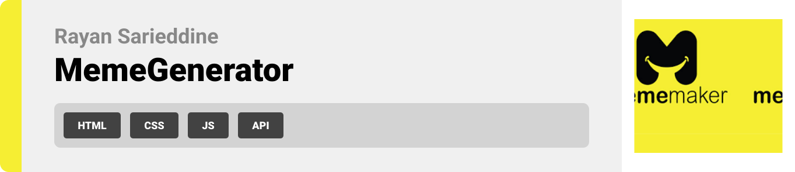
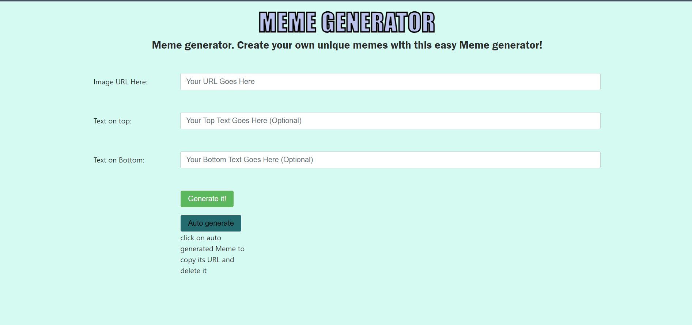

  

<!-- project philosophy -->

## Enables you to create your own memes, if you don't have any images you can click on auto generate to have an image auto generated and you can ciopy it's url by clicking on it

  

<!-- Prototyping -->

| 
